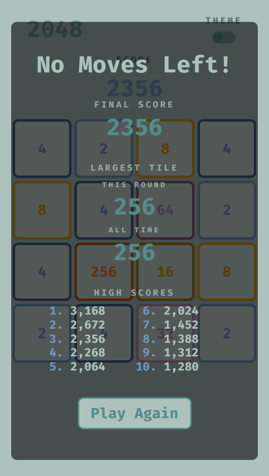

# My 2048 clone
### Made with HTML, CSS, and Vanilla JS

I decided to try my hand at making a clone of the 2048 game from scratch and this is what I came up with.  The game mechanics and scoring should be true to the original but I could have missed something.  I did what I could with the sliding block transitions to try and trick your eyes into thinking the tile is moving as opposed to the number and colors of the tile just changing.  There is probably a more effective way of going about this(let me know if you have any ideas), but this works for now.

For the touchscreen and mobile crowd I have implemented finger swipe gestures to you can play without a keyboard.  I was originally at a loss for how to make it work but stumbled across an easy to understand/implement solution but I can't seem to track down where I found it.

Let me know if you have any comments or suggestions!!

### Live Demo - https://jw-2048.netlify.app/

### Screenshots

.png)
---
.png)
---
